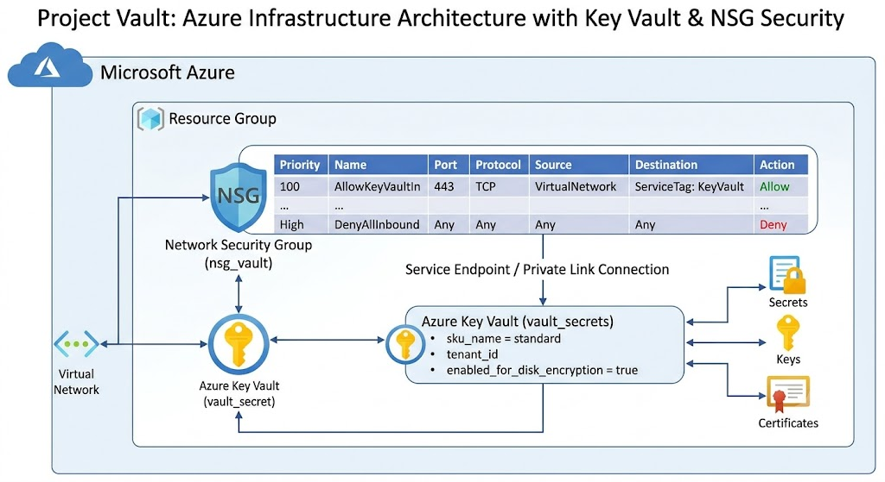
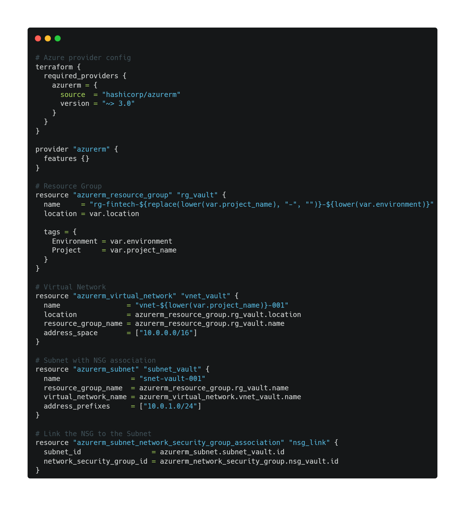
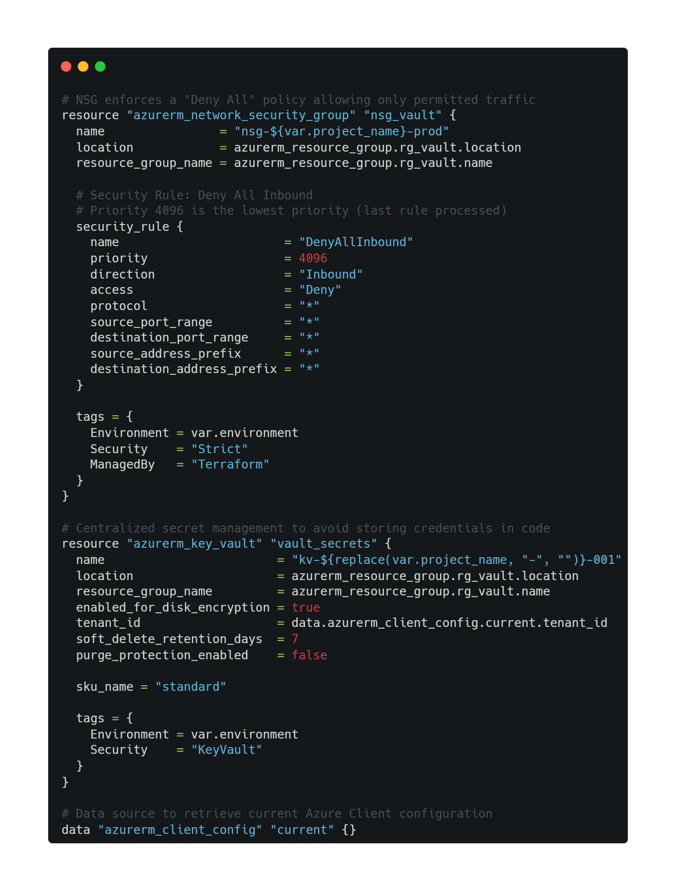
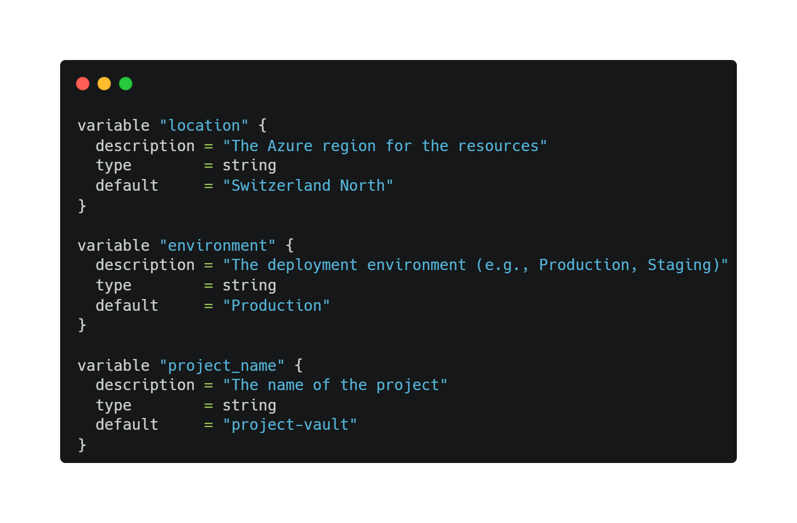
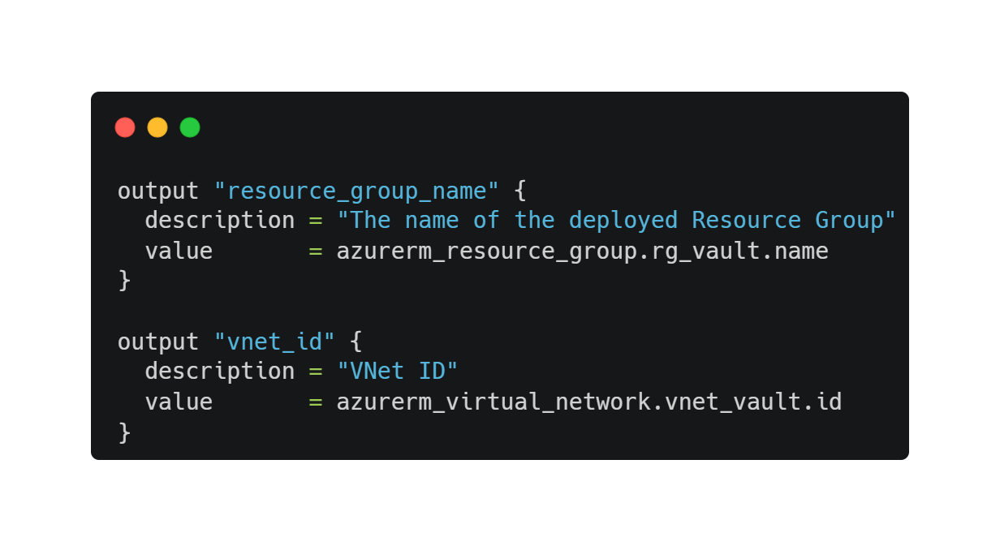

# Project Vault: Arquitectura Azure Hardened bajo el modelo Zero Trust

**Leer en:** [English](README.md) | [Español](README.es.md) | [Italiano](README.it.md)

## 🎯 Visión General
**Project Vault** es una implementación de infraestructura crítica en **Microsoft Azure** diseñada bajo el paradigma de **Seguridad por Diseño**. Centralizamos la gobernanza de activos en una base de código **Terraform** inmutable, auditable y escalable, eliminando configuraciones manuales propensas a errores.

## 💡 ¿Por qué Project Vault?
He creado este proyecto como una demostración técnica de mi capacidad para implementar entornos de nube profesionales. Con **Project Vault**, busco validar y exhibir mi dominio en:
* **Seguridad:** Aplicación práctica de principios *Zero Trust* y *Least Privilege*.
* **Automatización:** Dominio de *Infrastructure as Code* (IaC) para eliminar la intervención humana y garantizar consistencia.
* **DevSecOps:** Integración de flujos de trabajo de CI/CD que aseguran que la seguridad se verifique antes, durante y después del despliegue.
Este repositorio es mi "laboratorio de mejores prácticas", donde demuestro cómo transformar requisitos de seguridad abstractos en una arquitectura técnica funcional, mantenible y lista para producción.

## 🏗️ Diagrama de Arquitectura

## 🛡️ Pilares Estratégicos de Seguridad
* **Gestión Centralizada de Secretos:** Integración de **Azure Key Vault** para abstraer el ciclo de vida de las credenciales.
* **Segmentación de Red:** **NSG** con postura "Deny All", permitiendo solo tráfico explícitamente necesario.
* **Gobernanza mediante IaC:** Trazabilidad total de cambios mediante control de versiones.

## 🔍 Análisis de Componentes (Infraestructura como Código)
He estructurado el proyecto siguiendo las mejores prácticas de modularidad, separando la lógica en cuatro bloques clave:

### 1. `main.tf` - Orquestación

* **Función:** Define el despliegue principal y la interconexión de los recursos de Azure, sirviendo como el punto de entrada lógico de toda la arquitectura.

### 2. `security.tf` - Endurecimiento

* **Función:** Centraliza la lógica de **Network Security Groups (NSG)** y las políticas de acceso del **Key Vault**, manteniendo las reglas de seguridad aisladas del código de aprovisionamiento general.

### 3. `variables.tf` - Parametrización

* **Función:** Define las variables de entrada (nombres, regiones, SKUs), permitiendo que la infraestructura sea reutilizable en diferentes entornos (Dev/Staging/Prod) sin modificar el núcleo del código.

### 4. `outputs.tf` - Trazabilidad

* **Función:** Expone datos críticos post-despliegue (IDs de recursos, URLs de endpoints), facilitando la integración con otros servicios y la validación inmediata del estado final.

---

## 🛠️ Tech Stack
Este proyecto utiliza un ecosistema moderno enfocado en la nube y la seguridad:
* **Cloud:** Microsoft Azure (Resource Group, Key Vault, Virtual Network, NSG).
* **IaC:** HashiCorp Terraform (v1.x).
* **Seguridad:** Zero Trust Architecture, IAM granulares, Network Security Groups.
* **CI/CD:** GitHub Actions (Automated Workflows).
* **Control de Versiones:** Git (GitHub).

## 🤖 Ciclo de Vida DevSecOps (CI/CD)
La calidad del código se asegura mediante **GitHub Actions**, implementando **Shift-Left Security**:

## 📈 Roadmap de Escalabilidad
* **Backend Remoto:** Migración a *Azure Storage Account* con bloqueo de estado para trabajo colaborativo.
* **Módulos Reutilizables:** Refactorización para estandarizar despliegues de múltiples entornos.
* **Análisis SAST:** Integración automática de `tfsec` o `checkov` para escaneo de vulnerabilidades en tiempo de compilación.

## 🚀 Guía de Despliegue
1. `az login`
2. `terraform init`
3. `terraform plan`
4. `terraform apply`
5. `terraform destroy` (una vez hayas terminado para evitar costos indeseados)

## 🤝 Contribución
La seguridad es un proceso continuo. Si tienes experiencia en **Cloud Security** y deseas proponer mejoras, los *Pull Requests* son bienvenidos.